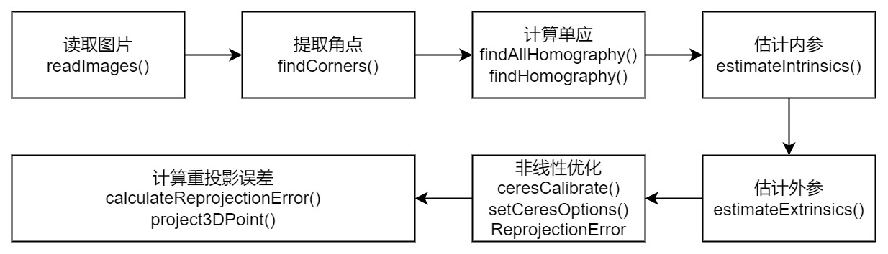

# zhangzy_single_camera_calibration
C++ Implementation of Zhang's Camera Calibration Method

Images in the data folder are generated by simulation with the following parameters:
- Chessboard
width = 11
height = 8
scale = 20(millimeter)
- Camera
fx = 500
fy = 500
cx = 319.5
cy = 239.5
k1 = 0
k2 = 0
k3 = 0
p1 = 0
p2 = 0